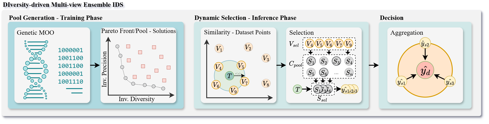

# DIME-IDS: DIversity-driven Multi-view Ensemble IDS

The **DIversity-driven Multi-view Ensemble IDS** (**DIME-IDS**) is introduced in the paper as a diversity-based, multi-view approach for improving intrusion detection in SCADA environments.  
It integrates **multi-objective feature optimization**, **ensemble diversity**, and **dynamic classifier selection** to enhance detection robustness, including against previously unseen attacks.

## Documentation

For detailed instructions on how to run the experiments, configure the parameters, and reproduce the results, see the [usage guide](./docs/usage_guide.md).

The dataset used in the paper is available at:  
[SCADA-MV-IDS Dataset](https://github.com/espindolaallan/SCADA-MV-IDS-Dataset)

## Citation

If you use this code in your research, please cite our paper (currently under review at **JNCA**):

> Espindola, A., Viegas, E., Casimiro, A., Santin, A., Ferreira, P.  
> *Enhancing Intrusion Detection Generalization via Diversity-Driven Multi-View Ensemble Learning in Industrial Systems.*  
> Submitted to **Journal of Network and Computer Applications (JNCA)**, 2025.

## License

This repository is released under the **MIT License**.  
You are free to use, modify, and distribute this code for research and educational purposes, provided proper attribution is given.  
See the [LICENSE](./LICENSE) file for more details.