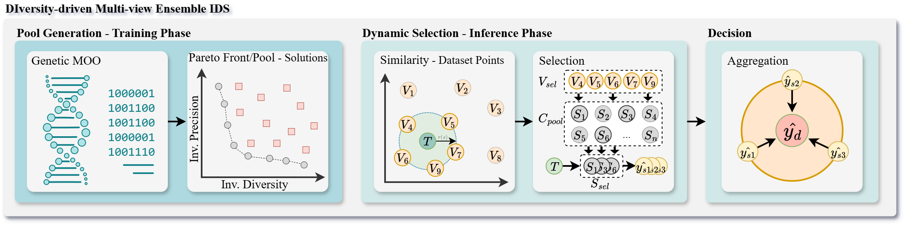

# DIME-IDS: DIversity-driven Multi-view Ensemble IDS

[](./LICENSE)
[](https://doi.org/10.1016/j.future.2026.108458)

The **DIversity-driven Multi-view Ensemble IDS** (**DIME-IDS**) is introduced in the paper as a diversity-based, multi-view approach for improving intrusion detection in SCADA environments.  
It integrates **multi-objective feature optimization**, **ensemble diversity**, and **dynamic classifier selection** to enhance detection robustness, including against previously unseen attacks.



## Documentation

For detailed instructions on how to run the experiments, configure the parameters, and reproduce the results, see the [usage guide](./docs/usage_guide.md).

The dataset used in the paper is available at:  
[SCADA-MV-IDS Dataset](https://github.com/espindolaallan/SCADA-MV-IDS-Dataset)

## Citation

If you use this code in your research, please cite:

```bibtex
@article{ESPINDOLA2026108458,
  title = {Enhancing Intrusion Detection Generalization via Diversity-Driven Multi-View Ensemble Learning in Industrial Systems},
  journal = {Future Generation Computer Systems},
  pages = {108458},
  year = {2026},
  issn = {0167-739X},
  doi = {https://doi.org/10.1016/j.future.2026.108458},
  url = {https://www.sciencedirect.com/science/article/pii/S0167739X26000920},
  author = {Allan Da S. Espindola and António Casimiro and Altair O. Santin and Pedro M. Ferreira and Eduardo K. Viegas},
  keywords = {Multi-view Detection, SCADA Security, Ensemble Diversity Optimization, Unseen Attack Generalization, Dynamic Classifier Selection}
}
```

## License

This repository is released under the **MIT License**.  
You are free to use, modify, and distribute this code for research and educational purposes, provided proper attribution is given.  
See the [LICENSE](./LICENSE) file for more details.
