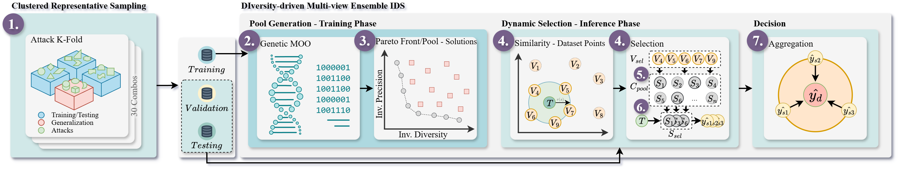

# Usage Guide — DIME-IDS

This document provides detailed instructions for running the experiments, configuring parameters, and reproducing the results described in the paper.
---

## 1. Overview

This repository implements the complete experimental pipeline for **DIME-IDS**, from attack subset selection to model training, similarity-based classification, dynamic classifier selection, and final evaluation.

---

## 2. Pipeline Steps

### Step 1 — Representative Attack Selection (`crs.py`)
- Enumerates all 4-of-16 attack combinations.
- Performs hierarchical clustering and selects **30 representative subsets**.

**Outputs:** `../results/crs/crs_chosen_combos.pkl`, `../results/crs/crs_coverage.csv`

---

### Step 2 — Multi-objective Feature Optimization (`run_combos.py` → `NSGA2Proposal.py`)
- Uses **NSGA-II** to optimize feature subsets and generate Pareto-front classifiers.

**Outputs:** `../results/nsga2/feature_selection`

---

### Step 3 — Retrain Pareto-front Classifiers (`retrain_pareto_pool.py`)
- Retrains classifiers from the Pareto fronts for each subset.
- Saves the trained models in `../results/models/pool/<combo_id>`.

---

### Step 4 — Similarity-based Classification (`batch_similarities.sh` → `similarity_based_classification.py`)
- Classifies new samples by selecting the most similar validation points.
- Supports **multiple distance metrics**: Euclidean, Cosine, Jaccard.

**Outputs:** `../results/selection/<pool>/<metric>/`

---

### Step 5 — Voting-based Prediction Aggregation (`validation_set_vote_counter.py`)
- Aggregates predictions from Step 4 using voting strategies (majority, any, soft).
- Produces overall classification results.

**Outputs:** `../results/selection/aggregated/`

---

### Step 6 — Dynamic Classifier Selection (`dynamic_selection.py`)
- Dynamically selects the **best-performing classifiers** per test sample.
- Uses precomputed accuracy statistics for optimized predictions.

**Outputs:** `../results/classification/classification_results_<pool_id>_<metric>.csv`

---

### Step 7 — Final Evaluation (`dynamic_selection_evaluation.py`)
- Evaluates classifier predictions and computes **global metrics** (Accuracy, F1, AUC) and **per-attack performance**.

**Outputs:** `../results/metrics/`

---

## 3. Important Notes

> While the paper reports results from **one representative run**, this repository supports **multiple runs** across different attack combinations.  
> It also allows selecting **different distance metrics** (e.g., Euclidean, Cosine, Jaccard) for similarity-based classification and dynamic classifier selection, enabling experiments beyond those presented in the paper.
